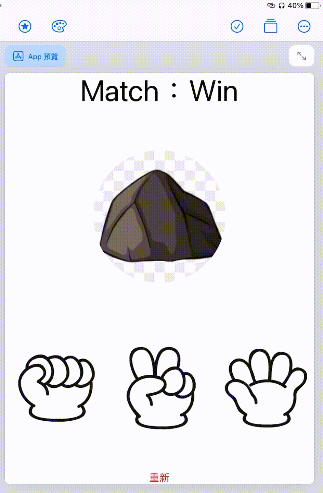

<h1>HW2</h1>
<table>
  <tr>
      <td>
        
      </td>
  </tr>
  

```swift
import SwiftUI
// HW2

struct HandView: View{
    var imgName:String
    var body: some View
    {
        VStack{
            
            Image(imgName)
                .resizable()
                .aspectRatio( contentMode:.fit)
                .frame(height: 100 ,alignment: /*@START_MENU_TOKEN@*/.center/*@END_MENU_TOKEN@*/)
        }
        .frame(minWidth: /*@START_MENU_TOKEN@*/0/*@END_MENU_TOKEN@*/, idealWidth: /*@START_MENU_TOKEN@*/100/*@END_MENU_TOKEN@*/, maxWidth: /*@START_MENU_TOKEN@*/.infinity/*@END_MENU_TOKEN@*/, minHeight: /*@START_MENU_TOKEN@*/0/*@END_MENU_TOKEN@*/, idealHeight: /*@START_MENU_TOKEN@*/100/*@END_MENU_TOKEN@*/, maxHeight: /*@START_MENU_TOKEN@*/.infinity/*@END_MENU_TOKEN@*/, alignment: /*@START_MENU_TOKEN@*/.center/*@END_MENU_TOKEN@*/)
    }
}

struct ContentView: View {
    @State var URcount:Int = -1
    @State var count:Int = -1
    @State var hand :String = "猜拳 Game"
    @State var result :String = "猜拳 Game"
    @State var pic :String = "game"
    var body: some View {
        
        Text(String("Match：\(result)"))
            .font(.system(size: 50))
        
        if(pic == "game"){
            Image("\(pic)")
                .resizable()
                .aspectRatio(contentMode: .fit)
                .foregroundColor(.accentColor)
            
                .frame(width:500, height: 300, alignment: /*@START_MENU_TOKEN@*/.center/*@END_MENU_TOKEN@*/)
        }
        else{
            Image("\(pic)")
                .font(.system(size: 50))
                .aspectRatio(contentMode: .fit)
                .foregroundColor(.accentColor)
                .clipShape(/*@START_MENU_TOKEN@*/Circle()/*@END_MENU_TOKEN@*/, style: /*@START_MENU_TOKEN@*/FillStyle()/*@END_MENU_TOKEN@*/)
                .frame(width:500, height: 300, alignment: /*@START_MENU_TOKEN@*/.center/*@END_MENU_TOKEN@*/)
        }
        HStack{
            Button(action: {
                var asd = Int(arc4random())
                asd = asd % 3
                count = asd
                pic = ""
                if count == 0{
                    pic = "剪刀2"
                    hand = "剪刀2"}
                else if count == 1{
                    hand = "石頭2"
                    pic = "石頭2"
                }
                else{ hand = "布2"
                    pic = "布2"
                }
                if hand == "布2" {result = "Lose"}
                else if hand == "剪刀2" {result = "Win"}
                else {result = "Draw"}
                print (count)   
            }, label: {
                Image("石頭1")
                    .resizable()
                    .aspectRatio(contentMode: .fit)
                    .foregroundColor(.accentColor)
                    .clipShape(/*@START_MENU_TOKEN@*/Circle()/*@END_MENU_TOKEN@*/, style: /*@START_MENU_TOKEN@*/FillStyle()/*@END_MENU_TOKEN@*/)
                    .frame(minWidth: /*@START_MENU_TOKEN@*/0/*@END_MENU_TOKEN@*/, idealWidth: /*@START_MENU_TOKEN@*/100/*@END_MENU_TOKEN@*/, maxWidth: /*@START_MENU_TOKEN@*/.infinity/*@END_MENU_TOKEN@*/, minHeight: /*@START_MENU_TOKEN@*/0/*@END_MENU_TOKEN@*/, idealHeight: /*@START_MENU_TOKEN@*/100/*@END_MENU_TOKEN@*/, maxHeight: /*@START_MENU_TOKEN@*/.infinity/*@END_MENU_TOKEN@*/, alignment: /*@START_MENU_TOKEN@*/.center/*@END_MENU_TOKEN@*/)
            }
                   
            )
            
            Button(action: {
                var asd = Int(arc4random())
                asd = asd % 3
                count = asd
                pic = ""
                if count == 0{
                    pic = "剪刀2"
                    hand = "剪刀2"}
                else if count == 1{
                    hand = "石頭2"
                    pic = "石頭2"
                }
                else{ hand = "布2"
                    pic = "布2"
                }
                if hand == "石頭2" {result = "Lose"}
                else if hand == "布2" {result = "Win"}
                else {result = "Draw"}
                
                print (count)   
            }, label: {
                Image("剪刀1")
                    .resizable()
                    .aspectRatio(contentMode: .fit)
                    .foregroundColor(.accentColor)
                    .clipShape(/*@START_MENU_TOKEN@*/Circle()/*@END_MENU_TOKEN@*/, style: /*@START_MENU_TOKEN@*/FillStyle()/*@END_MENU_TOKEN@*/)
                
                    .frame(minWidth: /*@START_MENU_TOKEN@*/0/*@END_MENU_TOKEN@*/, idealWidth: /*@START_MENU_TOKEN@*/100/*@END_MENU_TOKEN@*/, maxWidth: /*@START_MENU_TOKEN@*/.infinity/*@END_MENU_TOKEN@*/, minHeight: /*@START_MENU_TOKEN@*/0/*@END_MENU_TOKEN@*/, idealHeight: /*@START_MENU_TOKEN@*/100/*@END_MENU_TOKEN@*/, maxHeight: /*@START_MENU_TOKEN@*/.infinity/*@END_MENU_TOKEN@*/, alignment: /*@START_MENU_TOKEN@*/.center/*@END_MENU_TOKEN@*/)
                // Text("剪刀").foregroundColor(/*@START_MENU_TOKEN@*/.blue/*@END_MENU_TOKEN@*/)
            })
            
            Button(action: {
                var asd = Int(arc4random())
                asd = asd % 3
                count = asd
                pic = ""
                
                if count == 0{
                    pic = "剪刀2"
                    hand = "剪刀2"}
                else if count == 1{
                    hand = "石頭2"
                    pic = "石頭2"
                }
                else{ hand = "布2"
                    pic = "布2"
                }
                if hand == "剪刀2" {result = "Lose"}
                else if hand == "石頭2" {result = "Win"}
                else {result = "Draw"}
                
                print (count)   
            }, label: {
                Image("布1")
                    .resizable()
                    .aspectRatio(contentMode: .fit)
                    .foregroundColor(.accentColor)
                    .clipShape(/*@START_MENU_TOKEN@*/Circle()/*@END_MENU_TOKEN@*/, style: /*@START_MENU_TOKEN@*/FillStyle()/*@END_MENU_TOKEN@*/)
                    .frame(minWidth: /*@START_MENU_TOKEN@*/0/*@END_MENU_TOKEN@*/, idealWidth: /*@START_MENU_TOKEN@*/100/*@END_MENU_TOKEN@*/, maxWidth: /*@START_MENU_TOKEN@*/.infinity/*@END_MENU_TOKEN@*/, minHeight: /*@START_MENU_TOKEN@*/0/*@END_MENU_TOKEN@*/, idealHeight: /*@START_MENU_TOKEN@*/100/*@END_MENU_TOKEN@*/, maxHeight: /*@START_MENU_TOKEN@*/.infinity/*@END_MENU_TOKEN@*/, alignment: /*@START_MENU_TOKEN@*/.center/*@END_MENU_TOKEN@*/)
            }
                   
            )
            
            
            
          
        }
        Button(action: {
            count = -1
            URcount = -1
            print (count)
            hand = "猜拳 Game"
            result =  "猜拳 Game"
            pic = "game"
        }, label: {
            Text("重新")
        })
    }
}

```
</table>
