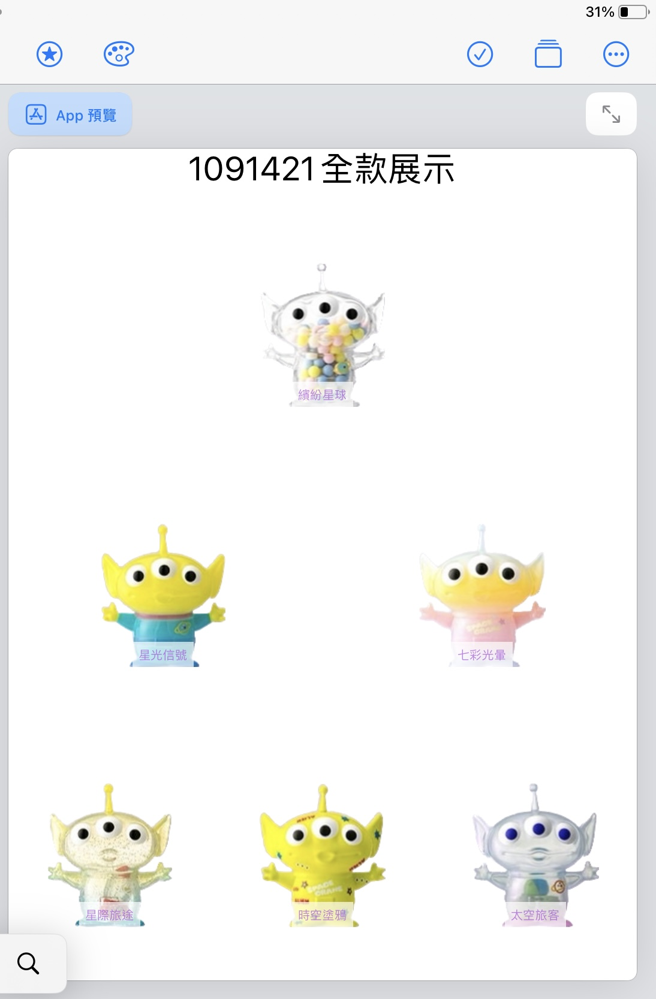

<h1>HW3</h1>
<table>
  <tr>
      <td>
        
      </td>
  </tr>
  

```swift
import SwiftUI
// HW3
struct nameView: View{
    var body: some View{
        VStack(alignment: /*@START_MENU_TOKEN@*/.center/*@END_MENU_TOKEN@*/, spacing:2) {
            Text("1091421全款展示").font(/*@START_MENU_TOKEN@*/.title/*@END_MENU_TOKEN@*/)
        }
        
    }
}

struct HandView: View{
    var imgName:String
    var tit:String
    var body: some View{
        ZStack{
            VStack{
                
                Image(imgName)
                    .resizable()
                    .aspectRatio( contentMode:.fit)
                    .frame(width:200 ,height: 120,alignment: /*@START_MENU_TOKEN@*/.center/*@END_MENU_TOKEN@*/)
                    .frame(minWidth: 0, idealWidth: 500, maxWidth: .infinity, minHeight: /*@START_MENU_TOKEN@*/0/*@END_MENU_TOKEN@*/, idealHeight: 200, maxHeight: /*@START_MENU_TOKEN@*/.infinity/*@END_MENU_TOKEN@*/, alignment: /*@START_MENU_TOKEN@*/.center/*@END_MENU_TOKEN@*/)
                
            }
            Text(tit)
                .font(.system(size:10))
                .foregroundColor(.purple)
                .padding(.all,5)
                .background(Color.white)
                .opacity(0.7)
                .offset(x:0,y:50)
                
        }
    }
}
struct ContentView: View {
    var body: some View {
        
        nameView()

        HStack{
            HandView(imgName: "11-1",tit: "繽紛星球")
        }
        HStack{
            HandView(imgName: "22-1",tit: "星光信號")
            HandView(imgName: "33-1",tit:"七彩光暈")
            
        }
        HStack{
            HandView(imgName: "44-1",tit: "星際旅途")
            HandView(imgName: "55-1",tit:"時空塗鴉")
            HandView(imgName: "66-1",tit:"太空旅客")
            
        }
        
    }
}

```
</table>
