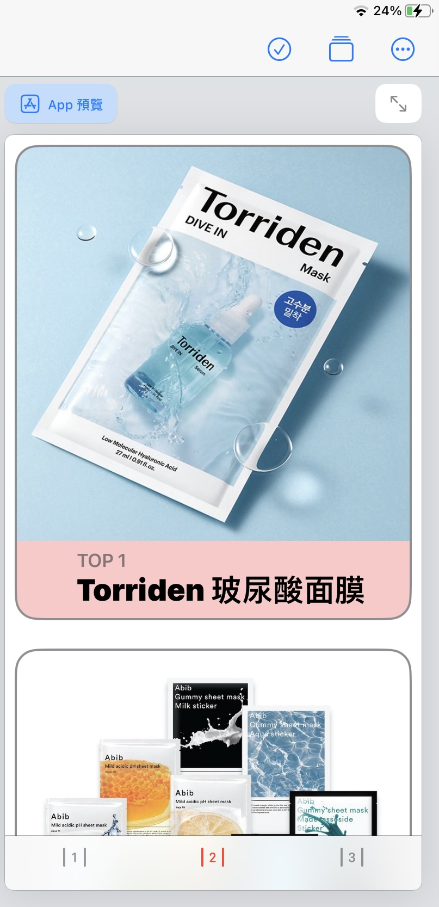
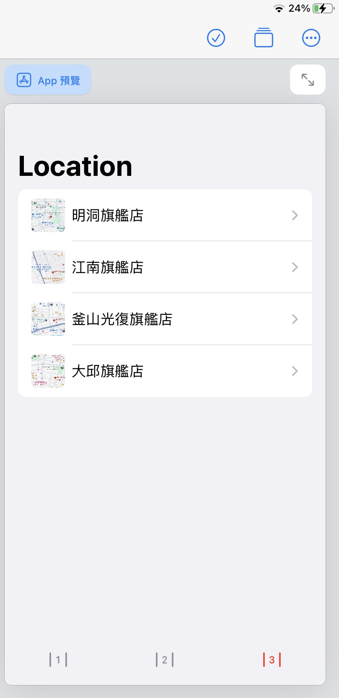

<h1>HW4</h1>
<table>
  <tr>
      <td>
        
        
        
      </td>
  </tr>


```swift
import SwiftUI

struct Thing :Identifiable{
    var id = UUID()
    var img:String
    var opt:String
    var Name:String
}
struct page3 :Identifiable{
    var id = UUID()
    var name:String
    var img:String
    var address:String
}
var item1 = [
    Thing(img:"Torriden",opt:"TOP 1", Name:"Torriden 玻尿酸面膜"),
    Thing(img:"Abib",opt:"TOP 2", Name:"Abib 口香糖魚腥草面膜"),
    Thing(img:"The saem",opt:"TOP 3", Name:"The saem 完美3合1遮瑕膏"),
    Thing(img:"Unove",opt:"TOP 4", Name:"Unove 深層受損修護髮膜"),
    Thing(img:"Ma:nyo",opt:"TOP 5", Name:"ma:nyo純淨柔護卸妝油"),
    
]

var item2 = [
    page3(name: "明洞旗艦店", img: "明洞",address:"서울 중구 명동길 53"),
    page3(name: "江南旗艦店", img: "江南",address:"서울 서초구 강남대로 429"),
    page3(name: "釜山光復旗艦店", img: "釜山",address:"부산 중구 비프광장로 36"),
    page3(name: "大邱旗艦店", img: "大邱",address:"대구 중구 동성로5길 33")]

struct BasicImageRow: View{
    var thisalbum:page3
    var body: some View{
        HStack{
            Image(thisalbum.img)
                .resizable()
                .frame(width: 40,height: 40)
                .cornerRadius(5)
            Text(thisalbum.name)
        }
    }
}

struct ListDetail:View{
    var thisalbum:page3
    var body: some View{
        VStack{
            Image(thisalbum.img)
                .resizable()
                .aspectRatio(contentMode: .fit)
                .clipped()
            Text(thisalbum.name)
                .font(.system(.title, design: .rounded))
                .fontWeight(.black)
            Text("地址：" + thisalbum.address)
                .font(.system(.caption, design: .rounded))
                .fontWeight(.black)
        }
        Spacer()
    }
}

struct ContentView: View {
    var body: some View {
        VStack {
            TabView{
                Group{
                    WelcomeView()
                        .tabItem {
                            Image(systemName:"1.lane")
                        }
                    
                    
                    ScrollView{
                        ForEach(item1){
                            thisHeat in           
                            CardView(img:thisHeat.img,Option:thisHeat.opt, Name:thisHeat.Name)
                        }
                    }
                    .tabItem { 
                        Image(systemName: "2.lane")
                    }
                    
                    
                    
                    NavigationView{
                        List(item2){albitem in
                            NavigationLink(
                                destination: ListDetail(thisalbum: albitem),
                                label: {BasicImageRow(thisalbum: albitem)
                                })
                        }
                        .navigationBarTitle("Location")}
                }
                .tabItem { Image(systemName: "3.lane") }
            }
            .tint(.red)
        }
    }
}
